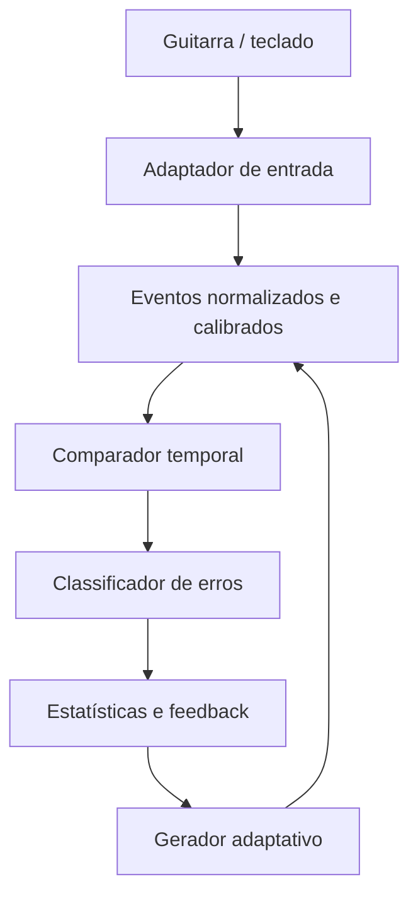

O produto seria menos um “Clone Hero sem músicas” e mais um treinador procedural: ele gera exercícios infinitos, observa exatamente o que foi pressionado e identifica padrões recorrentes de erro.



## Como funcionaria

### 1. Gerador de exercícios

Em vez de carregar uma chart, o usuário definiria:

- Técnica: HOPO, tapping, trill, zig-zag, escada, troca de posição etc.
- Frets permitidos.
- BPM.
- Subdivisão: colcheias, semicolcheias, tercinas.
- Tamanho e direção do padrão.
- Probabilidade de repetição, inversão ou variação.
- Janela de acerto desejada.
- Necessidade ou não de strum.

Um exercício poderia ser representado assim:

```ts
const drill = {
  notes: ['G', 'R', 'Y', 'B', 'O', 'O', 'B', 'Y', 'R', 'G'],
  bpm: 140,
  subdivision: 4,
  articulation: 'tap',
  repeat: true,
};
```

Também seria possível gerar padrões por regras:

```ts
{
  family: "ascending-descending",
  frets: ["G", "R", "Y", "B", "O"],
  length: 5,
  mutationRate: 0.15
}
```

Assim o programa pode criar variações novas sem exigir arquivos `.chart` ou `.mid`.

### 2. Captura do controle

Eu implementaria três formas de entrada:

1. **Gamepad API**, como opção principal para guitarras reconhecidas como joystick.
2. Teclado, útil para desenvolvimento e para quem joga dessa maneira.
3. **WebHID**, como modo avançado para controles que exponham dados HID mas não sejam mapeados corretamente como gamepad.

A Gamepad API funciona por consulta periódica de `navigator.getGamepads()` e fornece um timestamp da última atualização do dispositivo. Ainda assim, cada modelo de guitarra pode apresentar botões em posições diferentes, então seria indispensável um assistente inicial: “aperte verde”, “aperte vermelho”, “mova a palheta para baixo” etc. [Gamepad API](https://developer.mozilla.org/en-US/docs/Web/API/Gamepad_API/Using_the_Gamepad_API) e [timestamp do controle](https://developer.mozilla.org/en-US/docs/Web/API/Gamepad/timestamp).

WebHID daria mais controle sobre alguns dispositivos, mas tem disponibilidade limitada e funciona principalmente em navegadores Chromium; portanto deveria ser fallback, não a única entrada. Tanto Gamepad quanto WebHID exigem uma aplicação servida por HTTPS. [WebHID](https://developer.mozilla.org/en-US/docs/Web/API/WebHID_API).

Internamente, qualquer dispositivo produziria o mesmo formato:

```ts
type InputEvent = {
  time: number;
  frets: number; // bitmask: G=1, R=2, Y=4, B=8, O=16
  strum?: 'up' | 'down';
  pressed: number;
  released: number;
};
```

### 3. Comparação inteligente

Não basta comparar cada posição diretamente, pois um toque atrasado pode deslocar toda a sequência. O ideal é alinhar a execução real com a sequência esperada usando uma variação de distância de edição com custo temporal.

Ela classificaria:

- Nota correta dentro da janela.
- Nota antecipada ou atrasada.
- Nota omitida.
- Nota extra.
- Substituição de fret.
- Inversão de duas notas consecutivas.
- Fret correto mantido por tempo excessivo.
- Strum indevido ou ausente.
- Quebra de combo causada por release antecipado.
- Tendência de acelerar ou desacelerar.

No exemplo:

```text
Esperado: G R Y B O | O B Y R G
Executado: G R B Y O | O B Y R G
```

O alinhador inicialmente encontra `Y → B` e `B → Y`. Uma segunda camada percebe que são notas adjacentes em ordem invertida e gera um diagnóstico mais significativo:

> Você está invertendo amarelo e azul na subida. Isso ocorreu em 7 de 10 repetições, principalmente acima de 135 BPM.

Ou:

> O amarelo está, em média, 24 ms atrasado; por isso o azul é registrado primeiro.

Essa distinção importa: visualmente os dois casos parecem uma troca, mas a correção técnica pode ser diferente.

### 4. Estatísticas úteis

A plataforma poderia mostrar:

- Precisão total e por fret.
- Erro médio em milissegundos.
- Distribuição entre antecipado e atrasado.
- Matriz “nota esperada × nota pressionada”.
- Precisão de cada transição: `R→Y`, `Y→B`, `B→O`.
- Taxa de inversão por par de notas.
- Ponto de quebra por BPM.
- Desempenho na subida versus descida.
- Evolução ao longo das sessões.
- Mapa visual dos pontos problemáticos no padrão.

O diagnóstico não precisaria de inteligência artificial inicialmente. Regras estatísticas seriam mais previsíveis e explicáveis:

```ts
if (inversionCount('Y', 'B') >= 4 && inversionRate('Y', 'B') >= 0.3) {
  suggest({
    message: 'Você está invertendo Y e B na subida.',
    remedialDrill: ['R', 'Y', 'B', 'Y'],
    bpmAdjustment: -15,
  });
}
```

Depois do diagnóstico, o próprio sistema poderia criar um exercício corretivo, reduzir o BPM e só voltar a acelerar após algumas repetições consistentes.

## Sincronização e latência

Esse é o ponto mais delicado.

- O áudio e o metrônomo devem ser agendados pelo **Web Audio API**, não por `setInterval`.
- A animação pode usar `requestAnimationFrame`.
- A avaliação deve usar uma única linha de tempo de alta resolução.
- Antes de treinar, o usuário faz uma calibração de áudio, vídeo e controle.
- O sistema deve guardar o offset daquele dispositivo/navegador.

A Web Audio API oferece temporização de alta precisão e baixa latência; `AudioWorklet` permite processamento fora da thread principal quando necessário. [Web Audio API](https://developer.mozilla.org/en-US/docs/Web/API/Web_Audio_API) e [AudioWorklet](https://developer.mozilla.org/en-US/docs/Web/API/AudioWorklet).

Uma limitação real: a Gamepad API é baseada em polling. Em monitores de 60 Hz, consultar apenas durante a renderização pode reduzir a precisão ou perder mudanças extremamente rápidas. É importante aproveitar o timestamp informado pelo controle e medir o comportamento de cada dispositivo. A especificação confirma que esse timestamp representa a última atualização recebida do hardware. [Especificação da Gamepad API](https://www.w3.org/TR/gamepad/).

## Tecnologia sugerida

Uma implementação prática poderia usar:

- TypeScript para o motor.
- React, Vue ou Svelte para a interface — sem impacto no algoritmo central.
- Canvas 2D para a highway de notas.
- Web Audio API para metrônomo e efeitos.
- IndexedDB para sessões e estatísticas locais.
- Web Worker para análises mais pesadas.
- PWA para funcionar offline e parecer um aplicativo instalado.
- Backend opcional apenas para conta, sincronização e compartilhamento.

O núcleo de geração, captura e avaliação deveria ser uma biblioteca TypeScript independente da interface. Isso facilitaria testar o algoritmo e, futuramente, reaproveitá-lo em um aplicativo desktop.

## Escopo de um primeiro protótipo

Eu começaria com:

1. Assistente de mapeamento do controle.
2. Calibração simples.
3. Padrões manuais e dois geradores procedurais.
4. Highway de cinco frets com metrônomo.
5. Detecção de acerto, atraso, antecipação, omissão, substituição e inversão.
6. Relatório por fret e por transição.
7. Histórico local.
8. Treino corretivo automático.

Não tentaria reproduzir imediatamente todas as regras específicas de Clone Hero, Rock Band ou YARG. Elas podem virar perfis posteriores. O primeiro motor deveria ter suas próprias regras configuráveis.

Há também uma limitação física: uma guitarra comum informa qual botão foi pressionado, mas não qual mão ou dedo o pressionou. Portanto, o programa consegue diagnosticar sequência e timing, mas não afirmar diretamente que o usuário usou a mão errada. Guitarras com botões “solo” separados poderiam fornecer essa informação adicional.

O caminho mais sólido seria construir primeiro um protótipo focado exatamente no exercício `G R Y B O → O B Y R G`; ele já permitiria validar entrada, latência, alinhamento e a detecção da troca `Y/B` antes de expandir o gerador procedural.
