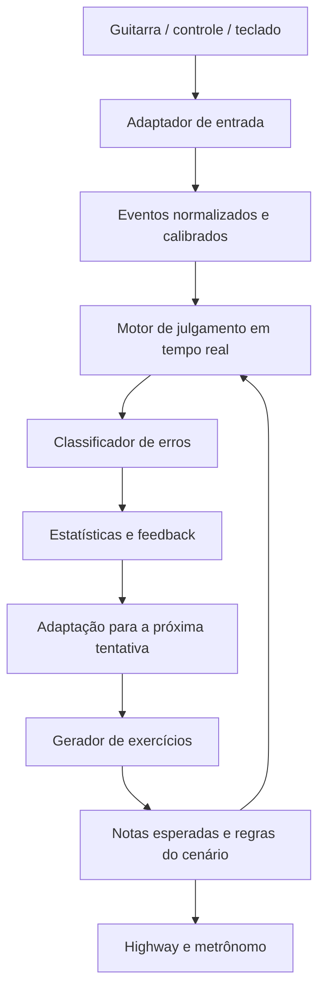

# Fretsense — treinador de técnicas de Guitar Hero / Rock Band

O Fretsense é uma proposta de treinador web para técnicas e cenários de gameplay de Guitar Hero e Rock Band com cinco frets. A interface permite configurar e repetir exercícios; um motor gera os padrões, interpreta as entradas e avalia a execução para identificar dificuldades específicas.

O treino deve funcionar com guitarras, controles convencionais e teclado. O teclado também deve permitir exercitar o fluxo completo durante o desenvolvimento, sem depender de uma guitarra física.

Este documento descreve o escopo proposto, não funcionalidades já implementadas. O projeto atual utiliza Vue 3, Quasar, TypeScript, Pinia e Vue I18n; a interface inicial ainda é a estrutura de exemplo do Quasar.

## Experiência de treino

1. Escolher e mapear o dispositivo de entrada.
2. Calibrar a entrada e o áudio.
3. Selecionar técnica, nível e cenário, ajustando BPM, frets, duração e regras de acerto.
4. Praticar em uma highway de cinco pistas, com contagem de entrada, metrônomo e feedback de execução.
5. Consultar uma avaliação do cenário e repetir o trecho ou aceitar um exercício corretivo.

O modo de prática permite repetição e ajustes entre tentativas. O modo de avaliação mantém as configurações durante a tentativa e registra técnica, nível, padrão, dispositivo, calibração e regras usadas, para contextualizar os resultados.



## Técnicas, cenários e níveis

Cada família deve oferecer exercícios isolados e combinações progressivas. Os níveis abaixo são uma proposta de progressão interna do treinador; as regras específicas de cada jogo podem ser adicionadas como perfis.

| Família | Inicial | Intermediário | Avançado | Avaliação específica |
| --- | --- | --- | --- | --- |
| Strum simples e alternado (alternate strum) | Notas espaçadas com strum simples | Alternância entre baixo e cima em notas repetidas | Rajadas, pausas e mudanças de fret com strum alternado | Timing, strums ausentes ou extras e direção, quando disponível |
| HOPO | Transições curtas com início por strum | Cadeias ascendentes e descendentes | Saltos, mudanças de direção e retomada após erro | Continuidade e cumprimento da regra de articulação configurada |
| Tapping | Alternância entre dois frets | Trills e padrões com fret de apoio | Sequências longas, saltos e transições entre tapping e strum | Ordem, timing e releases observados |
| Sequências (sequences) | Escadas curtas | Zig-zags, inversões e trocas de posição | Padrões mistos, saltos e mudanças de subdivisão | Omissões, substituições, inversões e precisão por transição |
| Notas duplas e triplas (acordes) | Acordes repetidos de dois frets | Trocas entre acordes e notas simples | Acordes de três frets e transições rápidas | Frets ausentes ou extras, simultaneidade e sincronização com o strum |
| Sustains | Sustentação de uma nota | Sustentação de acordes | Transições com frets mantidos e liberados conforme o cenário | Duração mantida e releases antecipados |
| Cenários mistos | Blocos de uma técnica por vez | Alternância entre duas técnicas | Combinações de acordes, sequências, HOPO, tapping e strum | Desempenho por trecho e erros nas mudanças de técnica |

A dificuldade deve considerar BPM, subdivisão, comprimento do padrão, quantidade de frets simultâneos, amplitude dos saltos e frequência de transições. Aumentar o nível não precisa significar apenas aumentar a velocidade ou reduzir a janela de acerto.

As metas de progressão devem ser configuráveis: precisão mínima, limite de erros e número de repetições consistentes. A adaptação ocorre entre tentativas, preservando as condições da avaliação em andamento.

## Como funcionaria

### 1. Gerador de exercícios

Em vez de carregar uma chart, o usuário definiria:

- Técnica e nível: strum simples ou alternado, HOPO, tapping, sequências, acordes duplos/triplos, sustains e combinações.
- Frets permitidos.
- BPM.
- Subdivisão: colcheias, semicolcheias, tercinas.
- Tamanho e direção do padrão.
- Probabilidade de repetição, inversão ou variação.
- Janela de acerto desejada.
- Necessidade ou não de strum.
- Direção exigida do strum, quando fizer parte do objetivo do exercício.
- Quantidade de frets simultâneos e duração das sustentações.
- Duração da tentativa, quantidade de repetições e metas de avaliação.

Um exercício poderia ser representado assim:

```ts
const drill = {
  notes: ['G', 'R', 'Y', 'B', 'O', 'O', 'B', 'Y', 'R', 'G'],
  bpm: 140,
  subdivision: 4,
  articulation: 'tap',
  repeat: true,
};
```

Também seria possível gerar padrões por regras:

```ts
{
  family: "ascending-descending",
  frets: ["G", "R", "Y", "B", "O"],
  length: 5,
  mutationRate: 0.15
}
```

Assim o programa pode criar variações novas sem exigir arquivos `.chart` ou `.mid`.

O exemplo acima representa apenas uma sequência de notas simples. Para cobrir o escopo geral, cada nota do motor deve informar posição musical, conjunto de frets simultâneos, duração e articulação (`strum`, `hopo` ou `tap`). Acordes devem ser julgados como um único evento com múltiplos frets. Cenários mistos precisam permitir articulações diferentes por nota, além de regras gerais do exercício.

O gerador deve aceitar uma semente para reproduzir o mesmo padrão. A configuração e o padrão gerado devem acompanhar o resultado da sessão, permitindo repetir a avaliação nas mesmas condições.

### 2. Captura do controle

O suporte de entrada proposto inclui:

1. **Gamepad API**, para guitarras reconhecidas como joystick e controles convencionais, com mapeamento configurável.
2. **Teclado**, com teclas configuráveis para os cinco frets, strum para cima/baixo e pausa. Deve permitir notas simples, acordes, sustains e as mesmas regras de treino dos demais dispositivos.
3. **WebHID**, como expansão para dispositivos que precisem de integração específica e não sejam atendidos pelo caminho principal.

O mapeamento deve salvar perfis por dispositivo e permitir conferir os frets pressionados e as ações de strum antes de começar. O motor recebe ações normalizadas, sem depender de índices de botões ou códigos de teclas.

Strum é uma ação de acionamento, não uma repetição automática enquanto o botão está mantido. No teclado, eventos de repetição de tecla não devem gerar novas notas ou strums. A perda de foco ou desconexão deve pausar a sessão e limpar o estado de entrada, evitando frets presos e erros atribuídos ao jogador durante a interrupção.

Os perfis devem registrar as capacidades disponíveis. Se a direção do strum não puder ser distinguida, o treino pode avaliar o timing, mas deve indicar que a alternância de direção não foi avaliada. A configuração do teclado deve permitir conferir se os acordes escolhidos são detectados no equipamento usado.

A Gamepad API funciona por consulta periódica de `navigator.getGamepads()` e fornece um timestamp da última atualização do dispositivo. Ainda assim, cada modelo de guitarra pode apresentar botões em posições diferentes, então seria indispensável um assistente inicial: “aperte verde”, “aperte vermelho”, “mova a palheta para baixo” etc. [Gamepad API](https://developer.mozilla.org/en-US/docs/Web/API/Gamepad_API/Using_the_Gamepad_API) e [timestamp do controle](https://developer.mozilla.org/en-US/docs/Web/API/Gamepad/timestamp).

WebHID daria mais controle sobre alguns dispositivos, mas tem disponibilidade limitada e funciona principalmente em navegadores Chromium; portanto deveria ser fallback, não a única entrada. Tanto Gamepad quanto WebHID exigem uma aplicação servida por HTTPS. [WebHID](https://developer.mozilla.org/en-US/docs/Web/API/WebHID_API).

Internamente, qualquer dispositivo produziria o mesmo formato:

```ts
type NormalizedInputEvent = {
  time: number; // tempo convertido para a linha de tempo comum do motor
  frets: number; // bitmask: G=1, R=2, Y=4, B=8, O=16
  strum?: 'up' | 'down' | 'unknown'; // ausente quando não houve strum
  pressed: number;
  released: number;
};
```

### 3. Comparação inteligente

O julgamento em tempo real deve decidir acertos, erros e combo usando as notas esperadas, a janela temporal, os frets ativos e as regras de articulação. O perfil do cenário define exigência de strum, condições de HOPO, tapping, aceitação de frets adicionais e comportamento de sustains. Essas regras devem ser explícitas e configuráveis; compatibilidade exata com versões específicas de GH/RB depende de perfis futuros.

Depois de um trecho ou tentativa, uma análise complementar pode alinhar a execução real com a sequência esperada usando uma variação de distância de edição com custo temporal. Isso permite diagnosticar sequências deslocadas sem alterar retroativamente o julgamento que o jogador recebeu durante o treino.

Ela classificaria:

- Nota correta dentro da janela.
- Nota antecipada ou atrasada.
- Nota omitida.
- Nota extra.
- Substituição de fret.
- Inversão de duas notas consecutivas.
- Fret correto mantido por tempo excessivo.
- Strum indevido ou ausente.
- Direção repetida quando o exercício exige alternância e o dispositivo fornece essa informação.
- Acorde incompleto, fret adicional ou acionamento dos frets fora da tolerância de simultaneidade.
- Quebra de combo causada por release antecipado.
- Tendência de acelerar ou desacelerar.

No exemplo:

```text
Esperado: G R Y B O | O B Y R G
Executado: G R B Y O | O B Y R G
```

O alinhador inicialmente encontra `Y → B` e `B → Y`. Uma segunda camada percebe que são notas adjacentes em ordem invertida e gera um diagnóstico mais significativo:

> Você está invertendo amarelo e azul na subida. Isso ocorreu em 7 de 10 repetições, principalmente acima de 135 BPM.

Ou:

> O amarelo está, em média, 24 ms atrasado; por isso o azul é registrado primeiro.

Essa distinção importa: visualmente os dois casos parecem uma troca, mas a correção técnica pode ser diferente.

### 4. Estatísticas úteis

A plataforma poderia mostrar:

- Precisão total e por fret.
- Erro médio em milissegundos.
- Distribuição entre antecipado e atrasado.
- Matriz “nota esperada × nota pressionada”.
- Precisão de cada transição: `R→Y`, `Y→B`, `B→O`.
- Taxa de inversão por par de notas.
- Ponto de quebra por BPM.
- Desempenho na subida versus descida.
- Evolução ao longo das sessões.
- Mapa visual dos pontos problemáticos no padrão.
- Precisão por técnica, nível e trecho nos cenários mistos.
- Regularidade e alternância do strum, quando observável.
- Acerto de acordes duplos/triplos e duração efetiva dos sustains.

O diagnóstico não precisaria de inteligência artificial inicialmente. Regras estatísticas seriam mais previsíveis e explicáveis:

```ts
if (inversionCount('Y', 'B') >= 4 && inversionRate('Y', 'B') >= 0.3) {
  suggest({
    message: 'Você está invertendo Y e B na subida.',
    remedialDrill: ['R', 'Y', 'B', 'Y'],
    bpmAdjustment: -15,
  });
}
```

Depois do diagnóstico, o próprio sistema poderia criar um exercício corretivo, reduzir o BPM e só voltar a acelerar após algumas repetições consistentes.

## Sincronização e latência

Esse é o ponto mais delicado.

- O áudio e o metrônomo devem ser agendados pelo **Web Audio API**, não por `setInterval`.
- A animação pode usar `requestAnimationFrame`.
- A avaliação deve usar uma única linha de tempo de alta resolução.
- Antes de treinar, o usuário faz uma calibração de áudio, vídeo e controle.
- O sistema deve guardar o offset daquele dispositivo/navegador.

A Web Audio API oferece temporização de alta precisão e baixa latência; `AudioWorklet` permite processamento fora da thread principal quando necessário. [Web Audio API](https://developer.mozilla.org/en-US/docs/Web/API/Web_Audio_API) e [AudioWorklet](https://developer.mozilla.org/en-US/docs/Web/API/AudioWorklet).

Uma limitação real: a Gamepad API é baseada em polling. Em monitores de 60 Hz, consultar apenas durante a renderização pode reduzir a precisão ou perder mudanças extremamente rápidas. É importante aproveitar o timestamp informado pelo controle e medir o comportamento de cada dispositivo. A especificação confirma que esse timestamp representa a última atualização recebida do hardware. [Especificação da Gamepad API](https://www.w3.org/TR/gamepad/).

## Organização do motor e da interface

A interface web deve cuidar da configuração, mapeamento, visualização da gameplay e relatórios. O motor TypeScript deve manter módulos para geração de exercícios, entrada normalizada, relógio e calibração, julgamento, análise e registro de sessões.

O julgamento deve funcionar independentemente dos componentes Vue e da renderização da highway. A interface consome o estado da sessão e os resultados produzidos pelo motor. Os adaptadores de guitarra, controle e teclado devem alimentar o mesmo contrato de entrada e passar pelo mesmo caminho de avaliação.

## Tecnologia

A stack atual define Vue 3, Quasar, TypeScript, Pinia e Vue I18n. Para implementar o treinador, a proposta é usar:

- TypeScript para o motor.
- Vue 3 e Quasar para a interface, Pinia para o estado da aplicação e Vue I18n para traduções.
- Canvas 2D para a highway de notas.
- Web Audio API para metrônomo e efeitos.
- IndexedDB para sessões e estatísticas locais.
- Web Worker para análises mais pesadas.
- PWA para funcionar offline e parecer um aplicativo instalado.
- Backend opcional apenas para conta, sincronização e compartilhamento.

O núcleo de geração, captura e avaliação deveria ser uma biblioteca TypeScript independente da interface. Isso facilitaria testar o algoritmo e, futuramente, reaproveitá-lo em um aplicativo desktop.

## Escopo de um primeiro protótipo

Eu começaria com:

1. Assistente de mapeamento de teclado, guitarra e controle, com visualização das entradas.
2. Calibração simples.
3. Padrões manuais e geradores de sequências e strum repetido/alternado, com parâmetros de dificuldade.
4. Highway de cinco frets com metrônomo.
5. Julgamento de notas simples e acordes duplos/triplos, com articulação configurada por nota, e detecção de acerto, atraso, antecipação, omissão, substituição e inversão.
6. Relatório por fret e por transição.
7. Histórico local.
8. Treino corretivo automático.

Não tentaria reproduzir imediatamente todas as regras específicas de Clone Hero, Rock Band ou YARG. Elas podem virar perfis posteriores. O primeiro motor deveria ter suas próprias regras configuráveis.

Há também uma limitação física: uma guitarra comum informa qual botão foi pressionado, mas não qual mão ou dedo o pressionou. Portanto, o programa consegue diagnosticar sequência e timing, mas não afirmar diretamente que o usuário usou a mão errada. Guitarras com botões “solo” separados poderiam fornecer essa informação adicional.

O caminho mais sólido seria construir primeiro um protótipo focado exatamente no exercício `G R Y B O → O B Y R G`; ele já permitiria validar entrada, latência, alinhamento e a detecção da troca `Y/B` antes de expandir o gerador procedural.

Essa primeira sequência é um recorte de implementação. O motor deve nascer com representação de acordes e articulação por nota para permitir ampliar o catálogo para tapping, HOPO, alternate strum, sustains e cenários mistos sem substituir seu modelo central. O catálogo completo e os níveis de cada família podem ser entregues de forma incremental.
